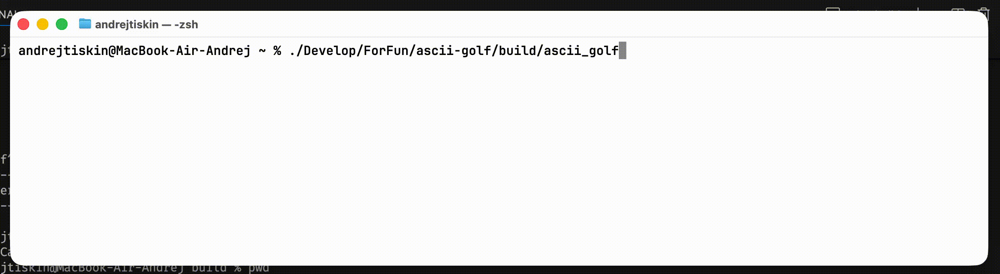
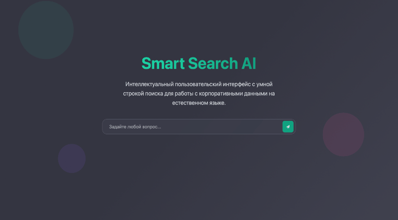

<h1 align="center">Доброго дня
</h1>

# 👨‍💻 Обо мне:

Я начинающий ML-инженер, back-end разработчик.

Мой путь в IT начался с обучения в Яндекс лицее где я прошел 2 годовых курса по Python.
Был опыт работы на фрилансе (в основном чат-боты и простенькие скрипты, а так-же backend на flask).
Во время учебы в ВУЗе работал в Сбер-Лаборатории (занимался backend'ом, деплоем, внедрением LLM).
Есть опыт в проектировании АЛУ и разработке под Микроконтроллеры.
Сейчас являюсь студентом четвертого курса бакалавриата ИИР НГУ на направлении "Искусственный интеллект".

<!--
https://pypi.org/user/andrei1112111/
-->

# 📡 Контакты:

<!--
Social networks buttons with links
-->

atishkin060705@gmail.com

## [Гольф на C++ с ascii графикой](https://github.com/andrei1112111/ascii-golf)

## [Умный поиск по корпоративной базе данных на естественном языке](https://github.com/andrei1112111/ascii-golf)

<!--
# 🛠 Работаю с:

-->
<!--

-->
<!--
### Языки:

| Python3 | C++ | Haskell | Assembly | SQL |
|---------|-----|---------|----------|-----|
|  |  |  |  |  |  |

### Фреймворки и библиотеки:

| Numpy  | Pandas | transformers | OpenCV | pytorch | skikit-learn | pydantic | Selenium | Flask | Pygame | PyQt5 |
|--------|--------|--------------|--------|---------|--------------|----------|----------|-------|--------|-------|
|  | | | | | | | | | | |

### Визуализация и работа с данными:

| Jupyter | Postgres | SQLite | Matpltlib | Seaborn |
|---------|----------|--------|-----------|---------|
|  |  |  |  |  |

### Тестирование, Развертывание и т.п:

| Git | Docker | Postman | Nginx | Cmake | Pytest |
|-----|--------|---------|-------|-------|--------|
|  |  |  |  |  |  |

### Операционные системы:

| Linux | Ubuntu | Debian | Macos |
|-------|--------|--------|-------|
|  |  |  |  |

### Остальное:

| Jira | Json | HTML | CSS | GitLab | CSV | YML |
|------|------|------|-----|--------|-----|-----|
|  |  |  |  |  |  |  |

-->
<!--
## 📚 Статьи на habr:
-->
<!-- BLOG-POST-LIST:START -->
<!-- BLOG-POST-LIST:END -->
<!--
## 📈 Литкод (работаю над этим c 03.02.2026):

# Гит
-->
<!--
Stats
-->
<!--

-->
<!--

-->
<!--
## На связи 🤝
-->
<!--

-->
<!--
<picture>
  <source media="(prefers-color-scheme: dark)" srcset="https://raw.githubusercontent.com/andrei1112111/andrei1112111/output/github-contribution-grid-snake-dark.svg">
  <source media="(prefers-color-scheme: light)" srcset="https://raw.githubusercontent.com/andrei1112111/andrei1112111/output/github-contribution-grid-snake.svg">
  
</picture>
-->
